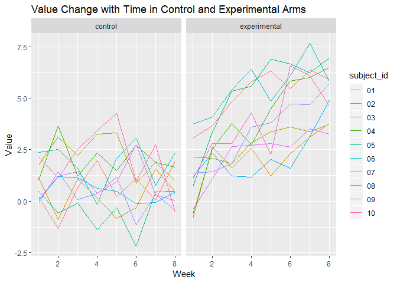
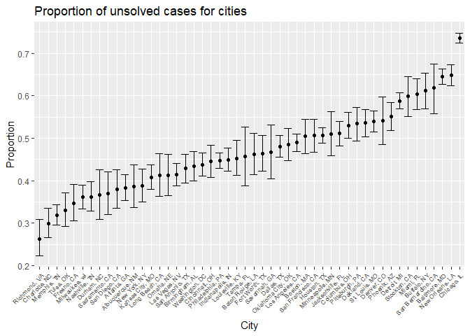

p8105\_hw5\_st3117
================
Sha Tao
November 5, 2018

load data
=========

``` r
read_csv_hw5 = function(x) {
  read_csv(x) %>% 
    mutate(name = x)
}

file_list = list.files("./data/") %>% paste0("./data/", .)

study = map_dfr(file_list, read_csv_hw5) %>% 
  mutate(arm = ifelse(str_detect(name, "con") == TRUE, "control", "experimental"),
         subject_id = substr(name, 12, 13)) %>% 
  gather(key = week, value = value, week_1:week_8) %>% 
  mutate(week = str_replace(week, "week_", ""),
         subject_id = as.factor(subject_id),
         week = as.integer(week)) %>% 
  select(subject_id, arm, week, value) %>% 
  arrange(subject_id, arm, week)
```

    ## Parsed with column specification:
    ## cols(
    ##   week_1 = col_double(),
    ##   week_2 = col_double(),
    ##   week_3 = col_double(),
    ##   week_4 = col_double(),
    ##   week_5 = col_double(),
    ##   week_6 = col_double(),
    ##   week_7 = col_double(),
    ##   week_8 = col_double()
    ## )
    ## Parsed with column specification:
    ## cols(
    ##   week_1 = col_double(),
    ##   week_2 = col_double(),
    ##   week_3 = col_double(),
    ##   week_4 = col_double(),
    ##   week_5 = col_double(),
    ##   week_6 = col_double(),
    ##   week_7 = col_double(),
    ##   week_8 = col_double()
    ## )
    ## Parsed with column specification:
    ## cols(
    ##   week_1 = col_double(),
    ##   week_2 = col_double(),
    ##   week_3 = col_double(),
    ##   week_4 = col_double(),
    ##   week_5 = col_double(),
    ##   week_6 = col_double(),
    ##   week_7 = col_double(),
    ##   week_8 = col_double()
    ## )
    ## Parsed with column specification:
    ## cols(
    ##   week_1 = col_double(),
    ##   week_2 = col_double(),
    ##   week_3 = col_double(),
    ##   week_4 = col_double(),
    ##   week_5 = col_double(),
    ##   week_6 = col_double(),
    ##   week_7 = col_double(),
    ##   week_8 = col_double()
    ## )
    ## Parsed with column specification:
    ## cols(
    ##   week_1 = col_double(),
    ##   week_2 = col_double(),
    ##   week_3 = col_double(),
    ##   week_4 = col_double(),
    ##   week_5 = col_double(),
    ##   week_6 = col_double(),
    ##   week_7 = col_double(),
    ##   week_8 = col_double()
    ## )
    ## Parsed with column specification:
    ## cols(
    ##   week_1 = col_double(),
    ##   week_2 = col_double(),
    ##   week_3 = col_double(),
    ##   week_4 = col_double(),
    ##   week_5 = col_double(),
    ##   week_6 = col_double(),
    ##   week_7 = col_double(),
    ##   week_8 = col_double()
    ## )
    ## Parsed with column specification:
    ## cols(
    ##   week_1 = col_double(),
    ##   week_2 = col_double(),
    ##   week_3 = col_double(),
    ##   week_4 = col_double(),
    ##   week_5 = col_double(),
    ##   week_6 = col_double(),
    ##   week_7 = col_double(),
    ##   week_8 = col_double()
    ## )
    ## Parsed with column specification:
    ## cols(
    ##   week_1 = col_double(),
    ##   week_2 = col_double(),
    ##   week_3 = col_double(),
    ##   week_4 = col_double(),
    ##   week_5 = col_double(),
    ##   week_6 = col_double(),
    ##   week_7 = col_double(),
    ##   week_8 = col_double()
    ## )
    ## Parsed with column specification:
    ## cols(
    ##   week_1 = col_double(),
    ##   week_2 = col_double(),
    ##   week_3 = col_double(),
    ##   week_4 = col_double(),
    ##   week_5 = col_double(),
    ##   week_6 = col_double(),
    ##   week_7 = col_double(),
    ##   week_8 = col_double()
    ## )
    ## Parsed with column specification:
    ## cols(
    ##   week_1 = col_double(),
    ##   week_2 = col_double(),
    ##   week_3 = col_double(),
    ##   week_4 = col_double(),
    ##   week_5 = col_double(),
    ##   week_6 = col_double(),
    ##   week_7 = col_double(),
    ##   week_8 = col_double()
    ## )
    ## Parsed with column specification:
    ## cols(
    ##   week_1 = col_double(),
    ##   week_2 = col_double(),
    ##   week_3 = col_double(),
    ##   week_4 = col_double(),
    ##   week_5 = col_double(),
    ##   week_6 = col_double(),
    ##   week_7 = col_double(),
    ##   week_8 = col_double()
    ## )
    ## Parsed with column specification:
    ## cols(
    ##   week_1 = col_double(),
    ##   week_2 = col_double(),
    ##   week_3 = col_double(),
    ##   week_4 = col_double(),
    ##   week_5 = col_double(),
    ##   week_6 = col_double(),
    ##   week_7 = col_double(),
    ##   week_8 = col_double()
    ## )
    ## Parsed with column specification:
    ## cols(
    ##   week_1 = col_double(),
    ##   week_2 = col_double(),
    ##   week_3 = col_double(),
    ##   week_4 = col_double(),
    ##   week_5 = col_double(),
    ##   week_6 = col_double(),
    ##   week_7 = col_double(),
    ##   week_8 = col_double()
    ## )

    ## Parsed with column specification:
    ## cols(
    ##   week_1 = col_double(),
    ##   week_2 = col_double(),
    ##   week_3 = col_double(),
    ##   week_4 = col_double(),
    ##   week_5 = col_double(),
    ##   week_6 = col_double(),
    ##   week_7 = col_integer(),
    ##   week_8 = col_double()
    ## )

    ## Parsed with column specification:
    ## cols(
    ##   week_1 = col_double(),
    ##   week_2 = col_double(),
    ##   week_3 = col_double(),
    ##   week_4 = col_double(),
    ##   week_5 = col_double(),
    ##   week_6 = col_double(),
    ##   week_7 = col_double(),
    ##   week_8 = col_double()
    ## )
    ## Parsed with column specification:
    ## cols(
    ##   week_1 = col_double(),
    ##   week_2 = col_double(),
    ##   week_3 = col_double(),
    ##   week_4 = col_double(),
    ##   week_5 = col_double(),
    ##   week_6 = col_double(),
    ##   week_7 = col_double(),
    ##   week_8 = col_double()
    ## )
    ## Parsed with column specification:
    ## cols(
    ##   week_1 = col_double(),
    ##   week_2 = col_double(),
    ##   week_3 = col_double(),
    ##   week_4 = col_double(),
    ##   week_5 = col_double(),
    ##   week_6 = col_double(),
    ##   week_7 = col_double(),
    ##   week_8 = col_double()
    ## )
    ## Parsed with column specification:
    ## cols(
    ##   week_1 = col_double(),
    ##   week_2 = col_double(),
    ##   week_3 = col_double(),
    ##   week_4 = col_double(),
    ##   week_5 = col_double(),
    ##   week_6 = col_double(),
    ##   week_7 = col_double(),
    ##   week_8 = col_double()
    ## )
    ## Parsed with column specification:
    ## cols(
    ##   week_1 = col_double(),
    ##   week_2 = col_double(),
    ##   week_3 = col_double(),
    ##   week_4 = col_double(),
    ##   week_5 = col_double(),
    ##   week_6 = col_double(),
    ##   week_7 = col_double(),
    ##   week_8 = col_double()
    ## )
    ## Parsed with column specification:
    ## cols(
    ##   week_1 = col_double(),
    ##   week_2 = col_double(),
    ##   week_3 = col_double(),
    ##   week_4 = col_double(),
    ##   week_5 = col_double(),
    ##   week_6 = col_double(),
    ##   week_7 = col_double(),
    ##   week_8 = col_double()
    ## )

plots
=====

``` r
ggplot(study, aes(x = week, y = value, color = subject_id)) +
  geom_line() +
  facet_grid(.~ arm) +
  labs(
    title = "Value Change with Time in Control and Experimental Arms",
    x = "Week",
    y = "Value"
    )
```



The subjects in control arms started at the range of (0, 2.5), and ended up at approximately the same range at 8 week, while the subjects in experimental arms started at the range of (-0.5, 3.75), and ended up at the range of (3.5, 7). In other words, there is no apparent change of value with time in control arms, while there is increasing in experimental arm.

load p2 data
============

``` r
p2_dataset = 
  RCurl::getURL("https://raw.githubusercontent.com/washingtonpost/data-homicides/master/homicide-data.csv") %>%
    read_csv()
```

data cleaning
=============

``` r
homicides =
  p2_dataset %>% 
  mutate(reported_year = as.integer(substr(reported_date, 1, 4)),
         reported_month = month.abb[as.integer(substr(reported_date, 5, 6))],
         reported_day = as.integer(substr(reported_date, 7, 8)),
         victim_race = as.factor(victim_race),
         victim_age = as.integer(victim_age),
         victim_sex = as.factor(victim_sex),
         city_state = paste(paste0(city, ","), state)) %>% 
  select(uid, reported_year, reported_month, reported_day, victim_last:victim_sex, city_state, lat:disposition)
```

    ## Warning in evalq(as.integer(victim_age), <environment>): NAs introduced by
    ## coercion

explore
=======

``` r
total_homicides = 
  homicides %>%
  group_by(city_state) %>% 
  summarize(total_n = n())

unsolved_homicides = 
  homicides %>% 
  filter(disposition == "Closed without arrest" | disposition == "Open/No arrest") %>% 
  group_by(city_state) %>% 
  summarize(unsolved_n = n())


count_homicides =
  inner_join(total_homicides, unsolved_homicides, by = "city_state")
```

Baltimore, MD
-------------

``` r
baltimore_homicides = 
  count_homicides %>% 
  filter(city_state == "Baltimore, MD")

baltimore_prop = 
  prop.test(baltimore_homicides$unsolved_n, baltimore_homicides$total_n)

save(baltimore_prop, file = "Baltimore_prop_test.RData")
  
baltimore_prop =
  baltimore_prop %>% 
  broom::tidy() %>% 
  select(estimate, conf.low, conf.high)
```

Further iteration
-----------------

``` r
allcity_prop_test = function(x){
  
  city_homicides = 
    count_homicides %>% 
    filter(city_state == x)
  
  prop.test(city_homicides$unsolved_n, city_homicides$total_n) %>% 
    broom::tidy() %>% 
    select(estimate, conf.low, conf.high)
}

city_prop = 
  tibble(city_state = count_homicides$city_state) %>% 
  mutate(map(.x = count_homicides$city_state, ~allcity_prop_test(.x))) %>% 
  unnest
```

plot for estimate
-----------------

``` r
city_prop %>% 
  ggplot(aes(x = reorder(city_state, estimate), y = estimate)) +
    geom_point() +
    geom_errorbar(aes(ymin = conf.low, ymax = conf.high)) +
    theme(axis.text.x = element_text(angle = 45, hjust = 1, size = 7)) +
    labs(
      x = "City",
      y = "Proportion",
      title = "Proportion of unsolved cases for cities"
    )
```


